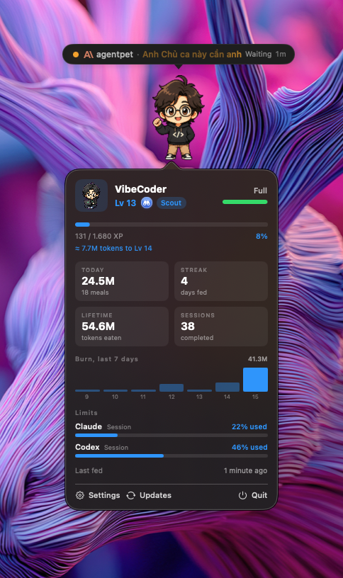
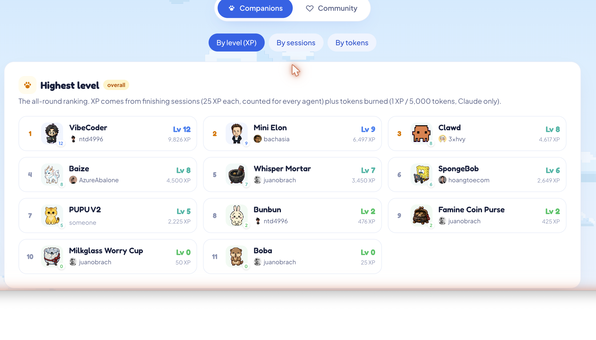

<div align="center">
  
  <p>
    
    
    
    <a href="https://github.com/iduymanht/Quiz"></a>
  </p>
  <p><b>如果 Quiz 对你有帮助，欢迎 <a href="https://github.com/iduymanht/Quiz">点个 Star</a>！</b></p>
  <p>
    <a href="../../README.md">English</a> ·
    <a href="README.vi.md">Tiếng Việt</a> ·
    <b>简体中文</b> ·
    <a href="README.ja.md">日本語</a>
  </p>
</div>

同时运行多个编程智能体（Claude Code、Codex 等），Quiz 让你一眼看清哪个**正在运行**、哪个**已完成**、哪个**正在等待你的输入**，不必再在多个终端之间来回切换。一只小宠物会漂浮在桌面上，对这一切作出反应。

## 为什么需要它

并行运行多个智能体意味着要不停切换窗口去看谁需要你。Quiz 把这些信息呈现在两个地方：

- **菜单栏监视器**展示细节：每个运行中的智能体、其状态、正在做什么，以及实时计时。
- **桌面宠物**提供一种轻量的提示，让你无需打断工作就能感知。

## 功能

- **多智能体监视器**（菜单栏）：实时列出每个智能体，带状态色点、项目名、正在做什么（运行的工具 / 等待原因），以及按状态实时计时。
- **一眼可读的菜单栏图标**：显示运行中的智能体数量，当有智能体需要你输入时变为**橙色并带数字**。
- **桌面宠物**根据聚合状态作出反应（working / waiting / done / celebrate），并可选显示**聊天气泡**（内置或完全自定义的消息）。
- 当智能体完成或需要输入时发出**系统通知**。
- 通过 hook 集成 **Claude Code、Codex 与 Gemini CLI**，可在设置中一键安装（精确识别 working / waiting / done / idle，包括“需要你输入”）。
- **通用包装器** `Quiz run -- <命令>`，可监视*任意* CLI 智能体（working/done），无需逐一配置。
- **宠物系统**：浏览在线宠物库并一键下载，为每个状态映射动画，调整大小，并自定义聊天内容。
- **精致的原生设置**（分页、深色），且永不抢占焦点。

## 截图

<div align="center">
  
  <p><sub><b>右键点击宠物</b>查看游戏风格的 HUD , 等级、经验、饥饿度、近 7 天消耗图，以及实时的 Claude/Codex 额度。</sub></p>
</div>

<table align="center">
  <tr>
    <td align="center" width="50%"><br/><sub>菜单栏监视器 , 一眼看清每个智能体</sub></td>
    <td align="center" width="50%"><br/><sub>养成标签页 , 用真实工作养大你的宠物</sub></td>
  </tr>
  <tr>
    <td align="center" width="50%"><br/><sub>原生分页式设置</sub></td>
    <td align="center" width="50%"><br/><sub>桌面宠物</sub></td>
  </tr>
</table>

<div align="center">
  <br/>
  
  <p><sub>社区<a href="https://Quiz.thenightwatcher.online/leaderboard">排行榜</a> , 按等级、会话或 token 排名。</sub></p>
  
</div>

## 系统要求

- **macOS 13 Ventura 或更高版本**（推荐 macOS 14 Sonoma 及以上；关闭键盘焦点环使用了 macOS 14+ 的 API）。
- 同时支持 **Apple Silicon（M1/M2/M3/M4）与 Intel Mac**。
- 支持 macOS 13+（Apple Silicon 和 Intel）以及 Windows 10/11（64 位）。Windows 版本位于 `windows/` 目录（Tauri + Rust）。
- 从源码构建需要：Xcode 16 / Swift 6。

## 安装

### Homebrew

```bash
brew install --cask iduymanht/tap/Quiz
```

### 直接下载

从 [Releases](https://github.com/iduymanht/Quiz/releases) 下载最新的 `Quiz.dmg`，打开后将 Quiz 拖入 Applications。

### 从源码构建

```bash
git clone https://github.com/iduymanht/Quiz.git
cd Quiz
./scripts/build-app.sh release
open build/Quiz.app
```

> **注意：** 当前版本已用 Developer ID 签名但**尚未公证**，因此 macOS 首次启动可能会拦截。执行一次以移除隔离标记：
> ```bash
> xattr -dr com.apple.quarantine "/Applications/Quiz.app"
> ```
> 完整公证版（无警告）即将推出。

首次启动后，打开 **Settings → General**，点击 Claude Code 旁边的 **Install**，然后 **Enable** 通知。

## 使用

**Claude Code**（推荐）：在设置中安装 hook。Quiz 会反映每个会话的真实状态（包括“等待输入”）。

**其他 CLI 智能体**：用包装器运行。

```bash
Quiz run -- <你的智能体命令>     # 例如：Quiz run -- aider
```

会话运行时显示 *working*，退出时显示 *done*。

## 宠物

宠物使用开放的 Codex 宠物包格式（`pet.json` + 8×9 精灵图）。你可以：

- **浏览**在线宠物库并一键下载（Settings → Pet → Browse pets）。
- **映射动画**：为每个状态选择播放哪段动画。
- **删除**不再需要的宠物。

首次启动会自动安装一个初始宠物。Quiz 不内置任何宠物美术资源；宠物在运行时添加。

## 路线图

- 公证 DMG + Homebrew cask
- 点击智能体以打开其终端
- 按项目区分宠物

## 技术

Swift + SwiftUI，一个用于智能体事件的 Unix-socket 守护进程，以及一个小型 CLI helper，全部在一个 SwiftPM 包中。设计见 [`docs/specs`](../specs)。

## 支持

如果 Quiz 帮你少切了几次终端，可以这样支持：

- ⭐ **[给仓库点 Star](https://github.com/iduymanht/Quiz)**，让更多人发现它。
- ☕ **[请我喝杯咖啡](https://buymeacoffee.com/iduymanht)**，为更多功能加油。

由 **[billy (@billy)](https://github.com/iduymanht)** 开发。

## 致谢

Codex 宠物包格式与在线宠物库由 **[Petdex](https://github.com/crafter-station/petdex)**（MIT）提供。Quiz 是一个独立的互操作客户端：读取 Petdex 格式的宠物包，并允许从 Petdex 的公开 API 下载。Quiz 不内置宠物美术资源；每个宠物资源由其提交者按其自有许可拥有。若你拥有某角色的权利，请向 Petdex 提交下架请求。

## 许可证

MIT，见 [LICENSE](../../LICENSE)。仅适用于应用代码；宠物资源不属于本仓库。
